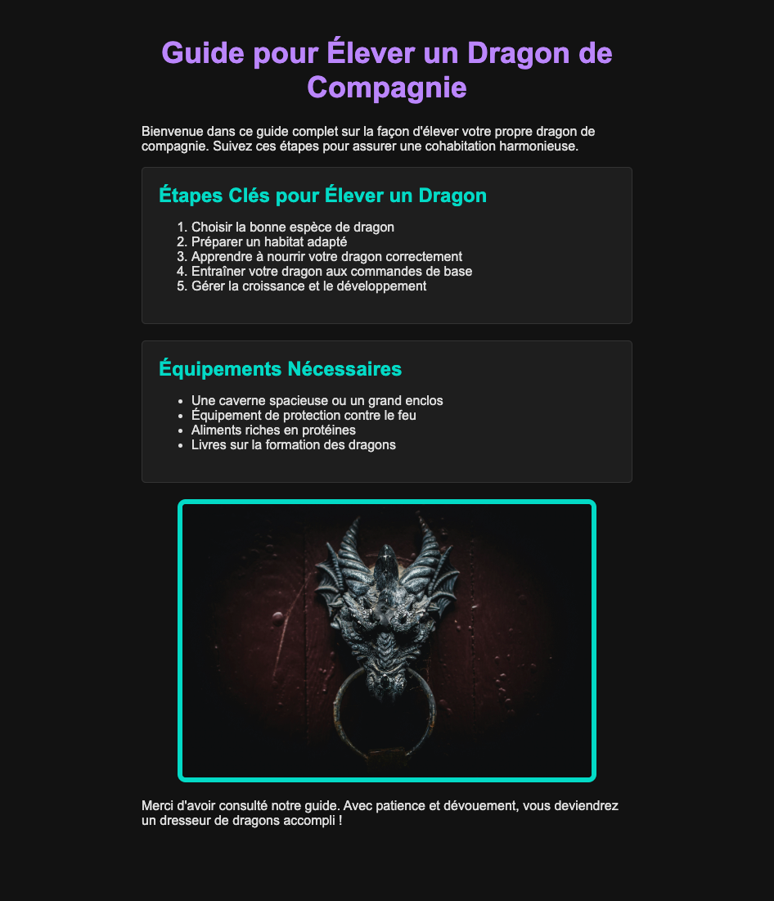

# Examen 1B - Intro CSS

## Installation

1. Clôner le repository
2. Ouvrir le dossier avec Visual Studio Code
3. Lancer l'extension Live Server avec le bouton "Go Live" en bas à droite de l'écran

## Consignes

- Intégrez la maquette en modifiant le fichier `styles.css`
- **Important**: Une seule ligne doit être ajoutée dans le fichier `index.html` (pour lier le fichier CSS)
- Vous n'avez rien à modifier dans le fichier `index.html` (sauf pour lier le fichier CSS)
- Toutes les indications supplémentaires sont dans le fichier `styles.css`

## Aperçu

